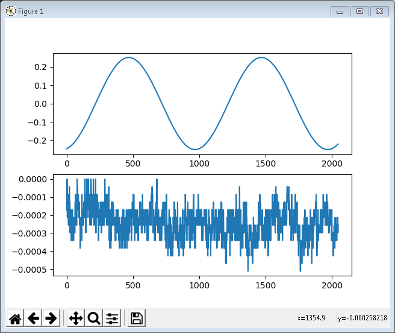

## PXIe-5820 Python .NET Example

This examples shows how to setup a system and run very basics RF examples from Python. The
approach are two approaches: calling the CLR (Common Language Runtime) to directly iterface
with .NET classes and creating wrappers around the driver c dll using cpython.

### Setting up Enviroment

- Install [Python](https://www.python.org/downloads/) 3.6.4
	- Version of Python is tied to Python .NET, pick your version according to their support
	- Install launcher for all users
	- Add Python 3.6 to PATH
	- Customization (pip, Documentation, IDLE, Test Suite, py launcher)
	- Everything else left as default (03-26-2018)

- Install NI-RFSA .NET Support
	- [National Instruments .NET Support](http://www.ni.com/product-documentation/14434/en/)
	- [RFSA](http://www.ni.com/download/ni-rfsa-17.1/6894/en/) be patient it is a big download
	- [.NET RFSA](http://www.ni.com/download/ni-rfsa-.net-class-library-17.1/6909/en/)
	- [.NET RFSG](http://www.ni.com/download/ni-rfsg-.net-class-library-17.1/6912/en/)

- Install some Python Packages 
	- python -m pip install -U pip setuptools
	- python -m pip install matplotlib
	- python -m pip install numpy

- Instal pythonnet
	- [Installation Wiki](https://github.com/pythonnet/pythonnet/wiki/Installation)
	'pip install pythonnet'

- Install .NET Framework 4.6.1
	- [.NET Framework 4.6.1](https://www.microsoft.com/en-us/download/details.aspx?id=49981)

### Testing the Envirotment
- Run \source\PythondoNetTest.py
	This examples simply import the clr and rfsa .NET libraries.

## Examples
1. ##### RFSAGettingStartedIQDevice.py
	This python script was created based on the RFSA example called: "RFSA Getting Started IQ (IQ Device).vi"
	```
	python source\RFSAGettingStartedIQDevice.py --resource PXI1Slot2
	```
2. #### RFSGGettingStartedIQDevice.py
	This python script was created based on the RFSA example called: "RFSG Getting Started Finite Generation (IQ Device).vi"
	```
	python source\RFSGGettingStartedIQDevice.py --resource PXI1Slot2
	```

Example of using both RFSA and RFSG with a pair mmpx cables looping I In to I
Out.



## Documentation
- C:\Program Files (x86)\IVI Foundation\IVI\Microsoft.NET\Framework32\v4.0.30319\NationalInstruments.ModularInstruments.NIRfsa 17.1.0\NINETRfsaFx40Ref.chm
- "C:\Program Files (x86)\IVI Foundation\IVI\Microsoft.NET\Framework32\v4.0.30319\NationalInstruments.ModularInstruments.NIRfsg 17.1.0\NINETRfsgFx40Ref.chm"
- Enum codes can be found in the LabVIEW help for the API. (e.g. RFSG->Generation Mode _1000_ means _CW_ per "Arb:Generation Mode" Property in NI RFSG Signal Generation Help)
- https://github.com/pythonnet/pythonnet
- http://zone.ni.com/reference/en-XX/help/375857A-01/html/allmembers_t_nationalinstruments_complexdouble/
- https://stackoverflow.com/questions/19600315/how-to-use-a-net-method-which-modifies-in-place-in-python
- http://ironpython.net/documentation/dotnet/dotnet.html#methods-with-ref-or-out-parameters
- https://stackoverflow.com/questions/16484167/python-net-framework-reference-argument-double

## License
[MIT License](https://github.com/NISystemsEngineering/Python-dotNet-5820/blob/master/LICENSE.md)
